# 嵌入式学习思维导图（项目实战版）

> 用途：把嵌入式从入门到工程实战的知识脉络捋顺，并绑定到本项目的 RK3506 + MCU + HMI + MQTT + 安全分层架构。
> 配套路线：[嵌入式工程师成长路径](embedded-expert-growth-path.md)

```mermaid
mindmap
  root((嵌入式工程能力))
    0 全局认知
      嵌入式不是只写代码
        电气
        芯片
        驱动
        系统
        控制
        通信
        可靠性
      AI 时代分工
        AI 写初稿
        人做验收
        人守住常识
        人亲手量波形
      项目主线
        RK3506 Linux
        MCU 或 M0
        现场设备采集
        本地 HMI
        MQTT 上行
        断网自治
        安全优先
      通信层级关系
        应用协议层
          决定大家说什么话
          例如 Modbus RTU 厂家私有协议 MQTT
          软件按协议组包和解析
        芯片通信外设层
          决定芯片怎么收发字节或比特
          UART I2C SPI CAN USB 是这一层
          在 RK3506 或 MCU 里面
        电气接口层
          决定信号用什么电压和线传出去
          TTL RS232 RS485 CAN 收发器是这一层
          负责抗干扰 距离 电平转换
        物理接线层
          真正接到端子或线缆
          例如 TX RX GND 或 RS485 A B
          现场接错线通常发生在这一层
        记忆例子
          Modbus RTU 是协议层
          UART 是芯片通信外设层
          RS485 是电气接口层
          A B 双绞线是物理接线层
        CAN 和 RS485 的层级差异
          RS485 更偏电气接口层
          RS485 上面常跑 Modbus RTU 或私有协议
          CAN 是芯片通信外设加总线机制
          CAN 自带帧格式 仲裁 CRC ACK 错误处理
        消防二总线和 RS485 的差异
          RS485 是通用工业电气传输方式
          消防二总线是消防厂家专用设备回路
          二总线常常通信和供电共线
          二总线管理烟感 温感 手报 输入输出模块
          二总线不能直接接普通 RS485 口
    1 硬件与电气基础
      电源
        3.3V
        5V
        24V 工业电源
        电源纹波
          电压不是平直线 而是在目标值附近小幅抖动
          纹波太大 会导致复位 通信不稳 ADC 乱跳
          万用表常看不出 要用示波器看
        上电时序
          通电时各路电源 复位 时钟的先后顺序
          不是有电就行 要按芯片要求排队启动
          顺序错了 可能偶发开不了机或外设识别不到
      IO 基础
        输入输出
        上拉下拉
          上拉 默认是 1 防止输入脚乱飘
          下拉 默认是 0 防止输入脚乱飘
          常见按键 上拉加按下接地
        推挽开漏
          推挽 能主动输出 1 也能主动输出 0
          开漏 只能主动拉低 输出 1 靠上拉电阻
          I2C 常用开漏 多个设备可共用线
        电平匹配
          两边电压语言要一致
          5V 不能随便直接接 3.3V 芯片
          不匹配要用电平转换或隔离
        去抖
          按键真实会连续抖几下
          MCU 太快 会误判成按了很多次
          软件常延时 10 到 20ms 再确认
      常见器件
        LED
        按键
        继电器
          小电控制大电的机械开关
          能控 220V 但慢 有声音 有寿命
          常用于泵 阀 灯等大负载通断
        MOS 管
          小电控制大电的电子开关
          快 无声 适合 PWM 调光调速
          常用于 LED 灯带 电磁阀 小电机
        光耦隔离
          用光传信号 两边电气不直接相连
          保护 MCU 免受 24V 220V 干扰或浪涌伤害
          常用于工业 DI 输入和隔离通信
        传感器
      工具
        万用表
        示波器
        逻辑分析仪
        串口工具
      验收能力
        灯不亮先量电
        通信不通先看波形
        判断电压电流是否合理
    2 MCU 入门闭环
      工具链
        编译
        烧录
        调试器
        SWD JTAG
        串口日志
      最小实验
        点灯
        按键中断
        串口打印
        定时器
        看门狗
          定期喂狗 表示程序还活着
          超时没喂 自动复位或进入安全态
          喂狗前要确认关键任务真的正常
      芯片基础
        时钟树
          MCU 内部的时间分配系统
          CPU UART 定时器 ADC 都需要节拍
          串口乱码或定时不准 可能是时钟错
        GPIO
          通用输入输出脚
          输入 读取按键和开关
          输出 控制 LED 继电器 蜂鸣器
        中断
          紧急事件来了 先停下当前工作去处理
          常见有按键 定时器 串口接收中断
          中断里不要做太慢的事
        寄存器
          MCU 内部控制硬件功能的开关表
          配 GPIO 串口 中断 本质都是改寄存器
          库函数底层也在改寄存器
        启动文件
          MCU 上电后最早执行的开机流程
          初始化栈 内存 中断向量表
          最后才进入 main
      项目落点
        跑通 MCU 最小工程
        建立 bringup 检查表
        理解 RK 与 MCU 的边界
    3 外设驱动与总线
      UART
        所属层级 芯片通信外设层
        不是现场线缆 是芯片里的串口功能
        同级有 I2C SPI CAN USB I2S LIN
        串口 两边用 TX RX 一位一位传数据
        TX 接对方 RX 双方 GND 要共地
        波特率
          说话速度
          两边必须一样
          不一样常见现象是乱码
        校验位
          简单检查这一小段数据有没有传错
          常见配置是 115200 8N1
          两边校验配置也必须一致
        收发缓冲
          临时存数据的小仓库
          接收缓冲先存收到的数据
          发送缓冲先存准备发的数据
          缓冲满了会丢数据
        粘包拆包
          粘包 多条消息粘在一起收到
          拆包 一条消息分几次收到
          UART 只认字节流 不认识消息边界
          解决靠换行 固定长度 或帧头长度CRC
      RS485
        所属层级 电气接口层
        不是 UART 同级 而是常接在 UART 外面
        工业机外壳上看到的是 A B 端子
        工业机内部常是 UART 接 RS485 收发器
        工业现场常用通信线 远距离 抗干扰 可挂多设备
        半双工
          像对讲机 能双向但不能同时说
          主机问 设备答 一个时间只允许一方讲话
        方向控制
          发送前切发送 发完切接收
          像按住对讲机说话 松开听别人说
          切错会只发不收 或占住总线
        A B 接线
          两根差分线 看 A 和 B 的电压差
          A B 接反常见现象是通信不通
          不同厂家 A B 标法可能相反 现场要核对
        终端电阻
          总线两端常加 120 欧
          作用是减少长线信号反射
          不是每个设备都加 只加两端
        多设备轮询
          主机按地址一个个点名
          被点到的设备才回答
          两个设备地址一样会一起回答导致撞车
        和 CAN 对比
          RS485 像主机一个个点名问设备
          两个设备同时说话会撞车
          冲突避免主要靠软件协议
          常用于变频器 电表 热量表 IO 模块
        和消防二总线对比
          RS485 通常只负责通信 不负责给设备供电
          消防二总线常常既供电又通信
          RS485 适合通用工业设备
          消防二总线适合探测器 模块 声光等消防回路设备
          两者都是两根线但不能混接
      I2C
        所属层级 芯片通信外设层
        和 UART 同级 都是芯片内部通信外设
        两根线通信 SCL 是时钟 SDA 是数据
        常用于板内短距离芯片通信
        地址
          每个 I2C 设备都有自己的门牌号
          主机先喊地址 被喊到的设备才回应
          地址冲突会导致两个设备同时回应
        ACK NACK
          ACK 表示我收到了
          NACK 表示没收到或不想继续
          I2C 不通先看有没有 ACK
        上拉电阻
          I2C 线默认靠上拉电阻变成高电平
          没有上拉 常见现象是通信不稳定或完全不通
          上拉太弱会变慢 上拉太强会耗电或拉不动
        时序
          谁先拉低 谁什么时候读数据的节奏规则
          SCL 控制节拍 SDA 在合适时间变化
          时序错了 设备会听不懂
      SPI
        所属层级 芯片通信外设层
        和 UART I2C 同级 但速度更快线更多
        多根线高速通信 常用于屏幕 Flash ADC 等
        CPOL CPHA
          决定时钟空闲时是高还是低
          决定在时钟哪一边沿读数据
          配错常见现象是读到的数据错位或乱码
        片选
          CS 或 SS 像点名线
          拉低谁的片选 就和谁通信
          多个 SPI 设备通常共用数据线 片选各自独立
        全双工
          可以一边发一边收
          像两个人同时递纸条
          每发一个字节 通常也会同时收到一个字节
      CAN
        所属层级 芯片通信外设层 加总线机制
        需要外接 CAN 收发器变成 CAN_H CAN_L
        多主通信
          每个节点有重要消息都可以主动发
          不一定要主机一个个点名
        仲裁
          多个节点同时发时硬件自动判断谁优先
          优先级高的消息先发
          优先级低的节点自动退让
        消息 ID
          CAN 更常按消息 ID 区分内容
          谁关心这个 ID 谁就接收
          不是简单按设备地址点名
        错误处理
          自带 CRC ACK 错误检测和重发机制
          总线异常时节点会进入错误状态
        典型用途
          汽车 BMS 电机控制 机器人 工程机械
          适合多控制节点和实时故障广播
        和 RS485 对比
          CAN 像有交通规则的总线
          RS485 像一条对讲机线路
          CAN 硬件处理冲突
          RS485 多靠协议避免冲突
          CAN_H CAN_L 不能和 RS485 A B 混接
      消防二总线
        所属层级 消防专用现场回路
        不是普通 RS485
        常见对象
          烟感
          温感
          手动报警按钮
          输入模块
          输出模块
          声光警报器
        通信加供电
          两根线常同时给探测器供电和通信
          探测器不一定单独拉电源
        厂家私有
          寻址方式 调制方式 编码方式多为厂家定义
          A 厂设备不一定兼容 B 厂主机
          不能随便用 RS485 口读取
        回路管理
          一条回路可挂很多地址设备
          项目目标可按 1 回路 200 点理解
          多回路可扩展到 8 回路 1600 点
        故障诊断
          短路
          开路
          掉线
          屏蔽
          未注册
          火警和反馈状态
        和 RS485 对比
          RS485 像通用工业通信道路
          二总线像消防设备生命线
          RS485 常见超时 CRC 无响应
          二总线要判断火警 故障 屏蔽 联动反馈
          不能互接 除非厂家提供转换网关或开放接口
      ADC PWM
        模拟量采集
          ADC 把连续变化的电压读成数字
          例如 0 到 10V 压力信号 先变成数字再算压力
          ADC 读的是电压 不是直接读温度压力
        量程换算
          把 ADC 数字换成真实物理量
          例如 0 到 10V 对应 0 到 1MPa
          公式错了 数据看起来会很离谱
        滤波
          传感器数据会抖 滤波是让数据更稳
          常见做法是平均值 中值 限幅
          不能滤太狠 否则真实变化会变慢
        阀门或电机控制
          PWM 是快速开关控制平均输出
          占空比越大 输出效果通常越强
          可用于调光 调速 阀门或电机驱动
      Modbus RTU
        工业现场常用串口协议 常跑在 RS485 上
        帧格式
          一条消息的固定结构
          常见包含地址 功能码 数据 CRC
          没有帧格式 接收方就不知道每段字节是什么意思
        CRC16
          用来检查一帧数据有没有传坏
          发送方算一次 接收方再算一次
          CRC 不一致就丢掉这帧
        超时重试
          问设备后等一段时间 没回复就认为超时
          超时后可以重发几次
          重试不能无限做 否则会拖死整个采集循环
        异常码
          设备告诉主机 我收到了但不能按要求执行
          例如功能不支持 地址不存在 数据非法
          异常码不是没通信 而是设备明确拒绝
      项目落点
        温度压力采集
          通过 ADC 或 Modbus 读取现场温度压力
          采到的数据要带单位 质量码 时间戳
        阀门反馈
          读取阀门开度或到位状态
          用来判断命令发出后阀门是否真的动作
        工业设备接入
          把变频器 电表 IO 模块等接入网关
          常见路径是 RS485 加 Modbus RTU
        点表映射
          把设备寄存器或 IO 通道映射成统一点位
          上层 HMI MQTT 控制逻辑都看点表 不直接碰底层地址
    4 数据采集与点表
      点位模型
        point_id
        value
        quality
        timestamp
        unit
        range
      质量码
        good
        offline
        timeout
        out_of_range
        sensor_fault
      采集循环
        周期采样
        设备轮询
        超时处理
        异常值过滤
      设备模板
        温度传感器
        压力传感器
        泵
        阀门
        变频器
      项目落点
        初始点表
        本地 HMI 数据
        上行遥测数据
    5 系统与实时性
      裸机
        主循环
        中断
        状态机
        简单可靠
      RTOS
        任务
        优先级
        队列
        信号量
        临界区
        调度延迟
      Linux
        用户态服务
        文件系统
        进程守护
        日志
        网络
        启动较慢
      实时性判断
        快环留 MCU 或 M0
        慢环可放 Linux
        安全兜底不依赖 Linux
      项目落点
        RK3506 A7 跑灵活逻辑
        M0 或独立 MCU 跑确定性逻辑
        Linux 与 MCU 心跳
    6 控制逻辑
      状态机
        自动
        手动
        故障
        急停
        维护
      PID
        设定值
        反馈值
        比例
        积分
        微分
        输出限幅
      供热控制
        气候补偿前馈
        一次侧阀 PID
        二次侧供温
        泵与阀协同
      异常处理
        超温
        超压
        缺水
        传感器故障
        执行器卡滞
      项目落点
        热源共控机控制逻辑
        runtime loops
        firmware simulator
    7 通信与平台
      MCU 与 RK 通信
        UART
        帧协议
        心跳
        快照
        事件
        CRC
      MQTT
        telemetry
        event
        command
        ack
        retained 与否
      断网自治
        本地控制继续
        数据缓存
        事件补传
        过期命令丢弃
      平台边界
        平台是顾问
        平台不是安全角色
        远程命令不能绕过本地安全
      项目落点
        MQTT 协议草案
        上行数据契约
        cloud gateway prototype
    8 HMI 与本地交互
      本地屏
        状态显示
        告警显示
        参数配置
        手自动切换
      数据展示
        点位列表
        设备卡片
        趋势
        告警记录
      操作边界
        高风险操作确认
        故障复位
        手动输出限制
        权限
      项目落点
        嵌入式 Web HMI
        设备显示 MVP
        本地屏优先于远程体验
    9 可靠性与安全
      安全分层
        机械
        硬接线
        MCU
        RK
        平台
      看门狗
        防止程序死了没人管
        喂狗就是定期说我还活着
        超时没喂说明系统可能卡死
        MCU 看 RK
          RK 定期给 MCU 发心跳
          MCU 收不到心跳就让输出进安全态
        硬件看门狗
        进程守护
        心跳超时进安全态
      失效场景
        Linux 卡死
        网络断开
        传感器失真
        阀门不动作
        断电恢复
        磁盘满
      工业级习惯
        异常路径设计
        日志滚动
        OTA 回滚
        人工确认复位
        故障可复现
      项目落点
        安全规则
        RK3506 与 MCU 职责 ADR
        平台命令有效期
    10 排障方法
      科学调试法
        先复现
        列假设
        一次只改一个变量
        用仪器验证
        记录根因
      常见问题
        灯不亮
        串口乱码
        RS485 无响应
        I2C 无 ACK
        PID 震荡
        设备偶发离线
      排查优先级
        电源
        接线
        波形
        配置
        协议
        代码
      AI 用法
        解释现象
        列假设
        生成测试
        查手册
        不直接当结论
    11 学习产出
      第 1 月
        上电 bringup 检查表
        点灯串口 demo
        基础排障记录
      第 2 到 3 月
        Modbus 采集 demo
        点表定义
        传感器接入记录
      第 4 到 6 月
        控制状态机
        PID 模拟器
        HMI 数据展示
      第 7 到 9 月
        MQTT 上行
        断网补传
        RK MCU 心跳
      第 10 到 18 月
        安全失效分析
        长跑测试报告
        疑难 bug 复盘库
```

## 最短学习路径

如果只想最快形成项目战斗力，按这个顺序走：

1. 电源、IO、万用表、串口。
2. GPIO、UART、RS485、Modbus。
3. 点表、质量码、采集循环。
4. 状态机、PID、故障锁定。
5. RK3506 Linux 服务、MQTT、本地 HMI。
6. RK 与 MCU 分工、心跳、看门狗。
7. 安全分层、断网自治、失效场景分析。

## 每次学习都问的 5 个问题

1. 这个知识点在真实硬件上对应什么现象？
2. 它坏了会怎么表现？
3. 我能用什么工具验证它？
4. 它在 RK3506 上做，还是在 MCU/M0 上做？
5. 如果 AI 给我代码，我能不能逐行讲清楚？
